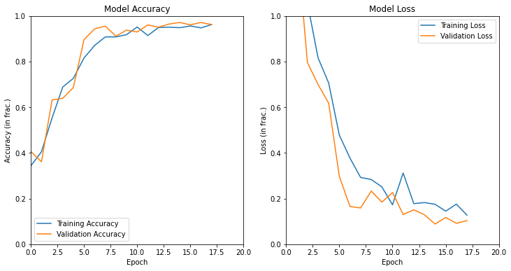

# Machine Learning Model: Rock Paper Scissor

_This work is a personal assignment for Dicoding as a part of the Digital Talent Scholarship._

 In this project, I use Python programming to build a CNN machine learning model. This model then is used to classify rock/paper/scissor hand-sign from provided image. This model is built using 2188 samples divided into 3 categories (rock, paper, and scissor). This model achieved more than 96% accuracy.

